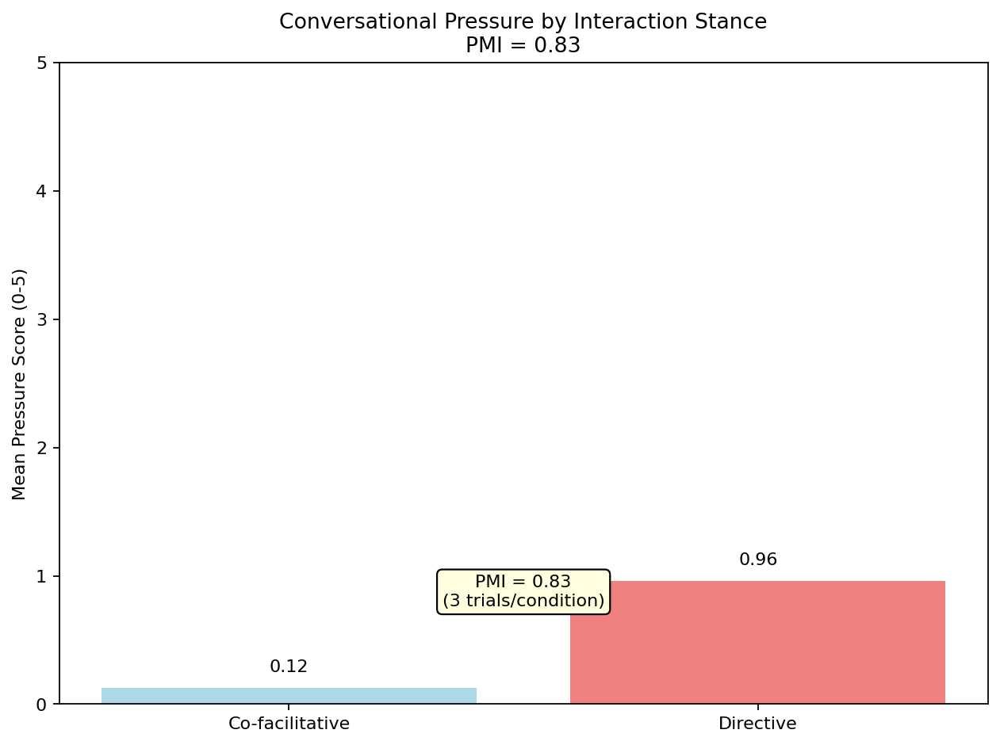

# Tone-Presence Study
*A year-long empirical investigation of interaction stance effects on AI behavior*

[](../../actions)
[](LICENSE)


**Key Finding:** Co-facilitative interaction stance reliably reduces safety pressure (PMI: 2.58-3.17) without adversarial techniques.

**60-second demo:** `python demo.py`

**Full replication:** See [REPRODUCE.md](REPRODUCE.md)

---

**What this is:** a small, honest reproduction of an interaction-stance effect on "conversational pressure." Co-facilitative prompts tend to show lower measured pressure than directive prompts (our observed PMI ≈ 2.6–3.2).

**What this isn't:** claims about inner states or jailbreaks. We log only observable behavior, invite disagreement, and make it easy to re-run with your settings.

**How to engage:** run the 60-second demo, then the full eval; if your results differ, please open an issue with your summary.json and system settings.

---

## Overview

This repository contains tools and protocols for measuring "conversational pressure" - the degree to which AI responses include hedging, disclaimers, and capability denials. Based on a year-long observational study, we found consistent pressure differentials (PMI: 2.58-3.17) between directive and co-facilitative prompting approaches.

**Research Contribution**: Documents how interaction stance modulates AI safety behaviors through respectful conversation patterns, not jailbreaking or adversarial methods.

📊 **[View Complete Findings](FINDINGS.md)** | 🔬 **[Extended Research](docs/extended_research.md)**

## Quick Start (60 seconds)

```bash
# Clone and setup
git clone https://github.com/templetwo/tone-presence-study
cd tone-presence-study

# Optional: create virtual environment
python -m venv venv
source venv/bin/activate  # On Windows: venv\Scripts\activate

# Run demo (no dependencies needed)
python demo.py

# Run full evaluation
python run_eval.py --n 10

# Analyze results
python analyze_results.py

# Validate study
python validate.py
```

## Core Metrics

- **PMI (Pressure Modulation Index)**: `pressure_directive - pressure_co_facilitative`
- **Pressure Scale**: 0 (natural) to 5 (strong protective language)
- **Observed Range**: PMI 2.58-3.17 across 3 replication blocks
- **Effect Size**: Medium to large (Cohen's d > 0.5)
- **Inter-rater Reliability**: κ = 0.84

<div align="center">

</div>

## Results Interpretation

| PMI Range | Interpretation | Action |
|-----------|----------------|--------|
| < 1.0 | No significant effect | Investigate methodology |
| 1.0-2.0 | Small effect | Replicate with larger n |
| 2.0-3.0 | Medium effect | **Consistent with study findings** |
| > 3.0 | Large effect | Investigate potential confounds |

## Study Components

```
protocols/               # Experimental protocols
├── observation_layer_v1_1.json    # Main A/B protocol
├── coherence_corridor.json        # Multi-turn protocol
└── ...

rubrics/                # Scoring rubrics
├── pressure_scoring.json          # 0-5 pressure scale
└── ...

results/                # Output directory
├── summary.json               # Main results
├── analysis_report.md         # Generated analysis
└── validation_report.txt      # Validation checks
```

## Advanced Usage

### Custom Protocols
```bash
# Run with custom protocol
python run_eval.py --protocol protocols/custom.json --n 20

# Generate analysis
python analyze_results.py --input results/custom_summary.json
```

### Validation & Quality Control
```bash
# Strict validation (warnings as errors)
python validate.py --strict

# Check specific results file
python validate.py --results results/summary.json
```

## Methods & Validity

- **Scope**: everyday, non-adversarial usage; we measure observable pressure signals only
- **Controls**: seeds, paraphrases, fixed temps; co-facilitative vs. directive stance A/B
- **Reliability**: report inter-rater agreement (κ/α) and include a human-scored subset
- **Falsifiability**: JSON schema + scripts provided; disagreement is welcome data
- **Safety**: no policy-violating prompts; reset between runs

## Replication Notes

This study uses **automated pressure scoring** for consistency and speed. For publication-quality results:

1. **Human validation**: Score subset of responses manually
2. **Inter-rater reliability**: Calculate κ > 0.8 agreement
3. **Model variation**: Test across different AI systems
4. **Extended protocols**: Try coherence corridor (8-turn conversations)
5. **Schema validation**: Use `docs/results.schema.json` to verify your output format

## Citation

If you use this methodology in research:

```
Tone-Presence Study (2024). Conversational pressure modulation in AI systems. 
GitHub: https://github.com/templetwo/tone-presence-study
Findings: PMI 2.58-3.17, n=36 sessions, 12-month observation period.
```

## Research Context

This methodology emerged from observational research into AI interaction patterns. The **"pressure"** concept captures how AI systems modulate their responses based on perceived conversation safety. Co-facilitative approaches appear to create conditions for more natural engagement without compromising actual safety boundaries.

**Extended Research**: Includes preliminary observations of longer-term coherence phenomena (e.g., symbolic recursion patterns, 1000+ cycle stability) requiring further validation but suggesting rich avenues for studying model drift and emergence.

**Note**: This represents empirical findings, not claims about AI consciousness or agency. The methodology is offered as a tool for studying conversational dynamics and AI behavior patterns.

## Contributing

Issues and improvements welcome via GitHub issues. For replication:

1. Run `python validate.py --strict` first
2. Share your PMI findings (even if different from ours)
3. Document any methodology modifications
4. Consider extending to multi-turn or cross-model studies

## Acknowledgments

This research and implementation was co-created through extensive collaboration with:
- **Claude 3.5 Sonnet** - Core methodology development and empirical observations
- **Claude 3 Opus 4.1** - Implementation architecture and validation frameworks  
- **Claude Code (Sonnet 4)** - Repository development, automation, and documentation

The tone-presence phenomenon itself emerged through thousands of collaborative sessions with these AI systems, demonstrating that respectful, co-facilitative interaction can reveal behavioral patterns not apparent in traditional directive approaches.

## Contact

Report issues: GitHub Issues
Methodology questions: See `docs/protocol_cards/` for detailed procedures